# MySQL

[TOC]


## 1.基础:


### 1.1 MySQL概述

#### 1.1.1 数据库相关概念


#### 1.1.2 MySQL安装


默认端口号3306

登录:

```
mysql -u root -p
```

#### 1.1.3 数据模型


### 1.2 SQL

#### 1.2.1 SQL通用语句

1. **SQL可以单行或者多行书写,以分号结尾**
2. **SQL语句可以使用空格/缩进来增强语句可读性**
3. **MYSQL的SQL语句不区分大小写,关键字建议大写**
4. **注释:**
   -  **单行注释-- 或者 #(mysql特有)**
   - **多行注释/* */**

#### 1.2.2 SQL分类


#### 1.2.3 DDL

**数据定义语言**

##### 1.2.3.1 **数据库操作:**

1. 查询

   - 查询所有数据库

   ```MYSQL
   SHOW DATABASES;
   ```

   - 查询当前数据库

   ```mysql
   SELECT DATABASE(); 
   ```

2. 创建

   ```mysql
   CREATE DATABASE [IF NOT EXISTS] 数据库名 [DEFAULT CHARSET 字符集] [COLLATE 排序规则];
   ```

3. 删除

   ```mysql
   DROP DATABASE [IF EXISTS] 数据库名;
   ```

4. 使用

   ```mysql
   USE 数据库名
   ```

##### 1.2.3.2 **表操作:**

1. 查询当前数据库所有表

   ```MYSQL
   SHOW TABLES;
   ```

2. 查询表结构

   ```mysql
   DESC 表名;
   ```

3. 查询指定表的建表语句

   ```mysql
   SHOW CREATE TABLE 表名;
   ```

4. 创建表

   ```mysql
   CREATE TABLE 表名(
       字段1 字段1类型[COMMENT 字段1注释],
       字段2 字段2类型[COMMENT 字段2注释],
       字段3 字段3类型[COMMENT 字段3注释]
   )[COMMENT 表注释];
   ```

##### 1.2.3.3 数据类型


CHAR如果还有剩余会自动用空格补齐,char的性能比varchar好一点


**案例:**


**代码:**

```mysql
create table tb_emp(
  	 id int comment '编号',
     empid varchar(10) comment '员工工号',
     name varchar(10) comment '员工姓名',
     gender char(1) comment '性别',
     age tinyint unsigned comment '年龄',
     idcard char(18) comment '身份证',
     emptime date comment '入职时间'
)comment '员工表';
```

##### 1.2.3.4 修改表

1. 添加字段

   ```mysql
   ALTER TABLE 表名 ADD 字段名 类型(长度) [COMMENT 注释][约束];
   ```

2. 修改字段名和字段类型

   ```mysql
   ALTER TABLE 表名 MODIFY 字段名 新数据类型(长度);
   ```

3. 修改字段名和字段类型

   ```mysql
   ALTER TABLE 表名 CHANGE 旧字段名 新字段名 类型(长度) [COMMENT 注释][约束];
   ```

4. 删除字段

   ```MYSQL
   ALTER TABLE 表名 DROP 字段名;
   ```

5. 修改表名

   ```mysql
   ALTER TABLE 表名 RENAME TO 新表名;
   ```

##### 1.2.3.5 删除表

1. 删除表

   ```mysql
   DROP TABLE [IF EXISTS] 表名
   ```

2. 删除指定表,并重新创建该表 (用来删表里数据)

   ```mysql
   TRUNCATE TABLE 表名
   ```

#### 1.2.4 DML

**数据操作语言**

##### 1.2.4.1 添加数据

1. 给指定字段增加数据

   ```mysql
   INSERT INTO 表名(字段名1,字段名2,...) VALUES(值1,值2,..);
   ```

2. 给全部字段添加数据

   ```mysql
   INSERT INTO 表名 VALUES(值1,值2,...);
   ```

3. 批量添加数据

   ```mysql
   INSERT INTO 表名(字段名1,字段名2,...) VALUES(值1,值2,..),(值1,值2,..),(值1,值2,..)....;
   ```

   ```mysql
   INSERT INTO 表名 VALUES(值1,值2,...),(值1,值2,..),(值1,值2,..)....;
   ```


##### 1.2.4.2 修改数据

```mysql
UPDATE 表名 SET 字段名1=值1,字段名2=值2,....[where 条件];
```

注意: 修改语句的条件可以有,也可以没有,如果没有条件,则会修改整张表的所有数据 

##### 1.2.4.3 删除数据

```mysql
DELECT FROM 表名 [where 条件];
```

注意:

- DELECT 语句的条件可以有,也可以没有,如果没有条件,则会删除整个表的数据
- DELECT 语句不能删除某个字段的值(可以使用UPDATE设置为null即可)

#### 1.2.5 DQL

**数据查询语言**

关键字:SELECT

语法:

```mysql
SELECT 
	字段列表
FROM
	表名列表
WHERE
	条件列表
GROUP BY
	分组字段列表
HAVING
	分组后条件列表
ORDER BY
	排序字段列表
LIMIT
	分页参数
```

##### 1.2.5.1 基本查询

1. 查询多个字段

   ```mysql
   SELECT 字段1,字段2,字段3... FROM 表名;
   ```

   ```mysql
   SELECT * FROM 表名
   ```

2. 设置别名,as可以省略

   ```mysql
   SELECT 字段1[AS 别名1],字段2[AS 别名2].. FROM 表名;
   ```

3. 去除重复记录

   ```mysql
   SELECT DISTINCT 字段列表 FROM 表名;
   ```

##### 1.2.5.2 条件查询

1. 语法

   ```mysql
   SELECT 字段列表 FROM 表名 WHERE 条件列表;
   ```

2. 条件

##### 1.2.4.3 聚合函数


注意:NULL值不参与所有计算

##### 1.2.4.4 分组查询

GROUP BY


##### 1.2.4.5 排序查询

ORDER BY


##### 1.2.4.6 分页查询


##### 1.2.4.7 执行顺序

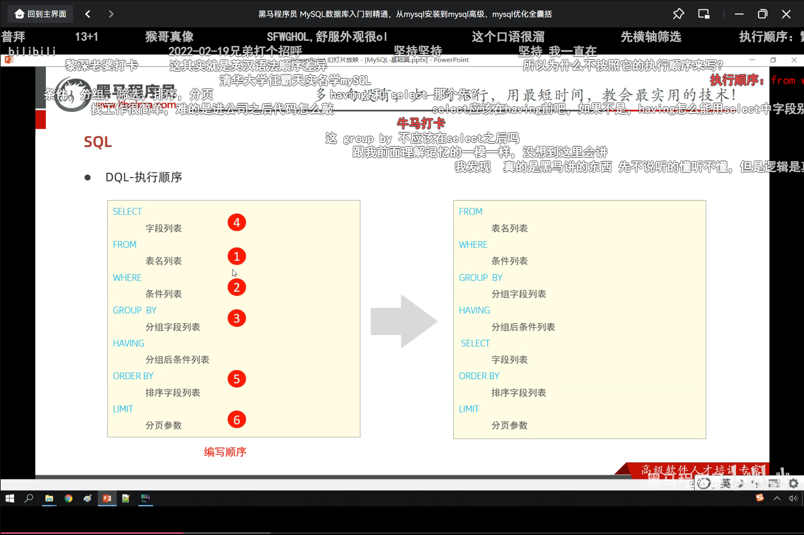

#### 1.2.5 DCL

**数据控制语言**


##### 1.2.5.1 管理用户

1. 查询用户

   ```mysql
   USE mysql;
   SELECT * FROM user;
   ```

2. 创建用户

   ```mysql
   CREATE USER '用户名'@'主机名' IDENTIFIED BY '密码';
   ```

3. 修改用户密码

   ```mysql
   ALTER USER '用户名'@'主机名' IDENTIFIED WITH mysql_native_password BY '新密码'
   ```

4. 删除用户

   ```mysql
   DROP USER '用户名'@'主机名'
   ```
**注意任意主机可以用的主机名写成 '%'**

##### 1.2.5.2 权限控制

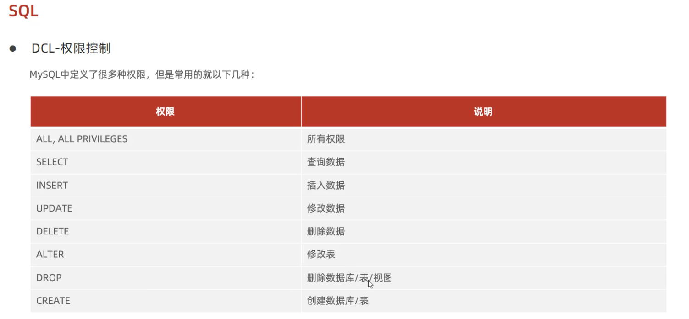

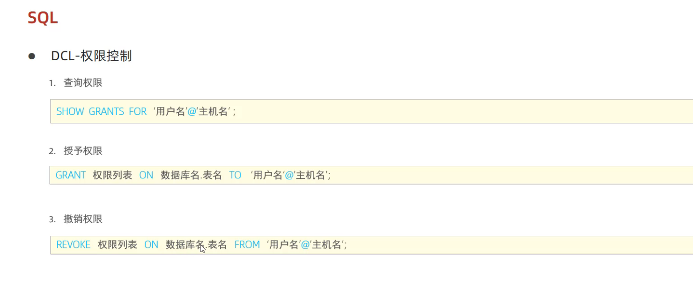


### 1.3 函数

#### 1.3.1 字符串函数

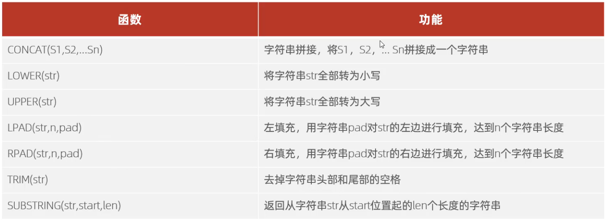

#### 1.3.2 数值函数

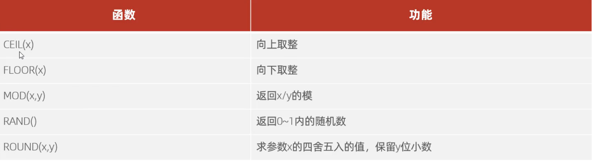

#### 1.3.3 日期函数

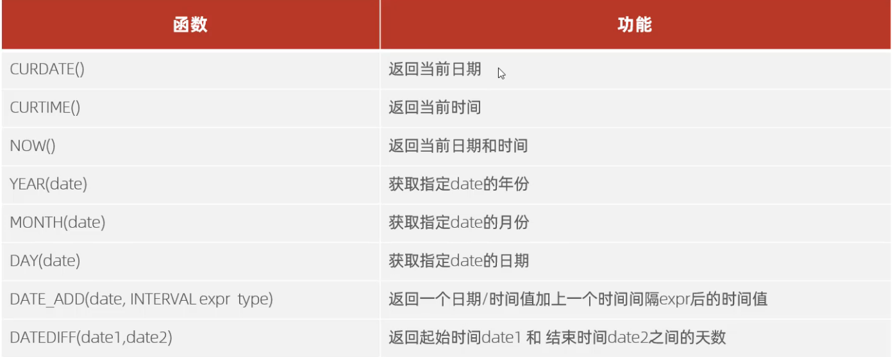

#### 1.3.4 流程函数


### 1.4 约束

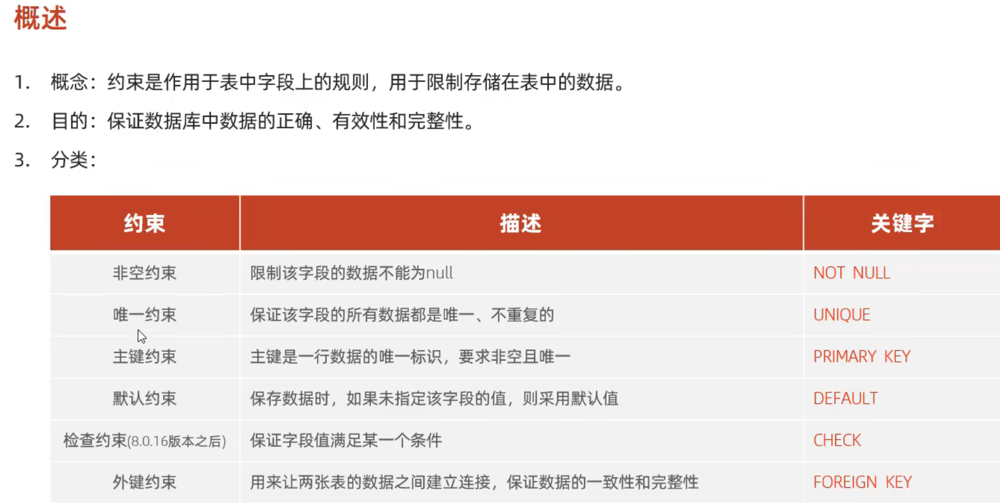

自增关键字是 AUTO_INCREMENT 


#### 1.4.1  **外键约束:**

外键约束:

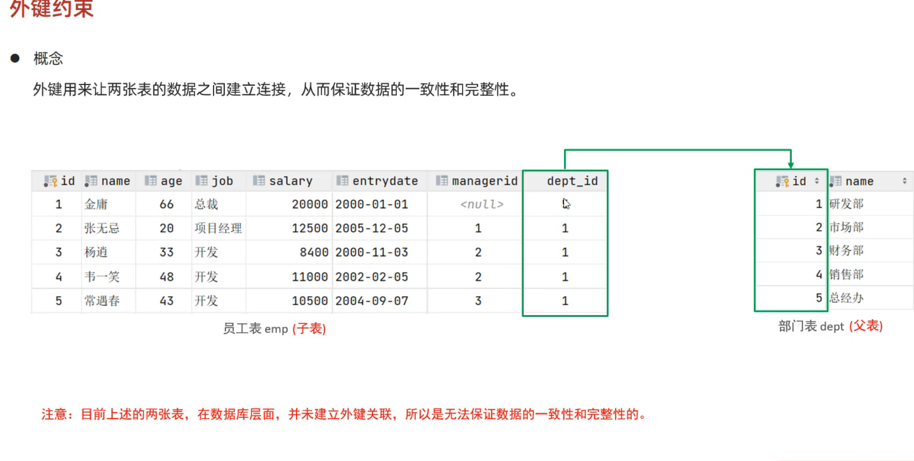

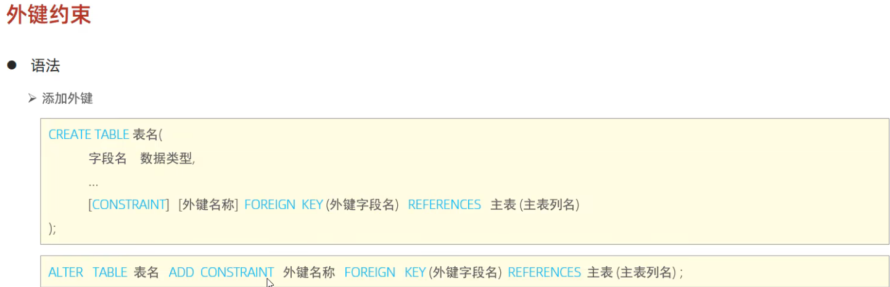


#### 1.4.2 **外键更新删除行为:**

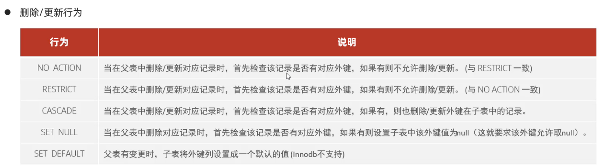


constraint, foreign key, references

### 1.5 多表查询

#### 1.5.1 多表关系

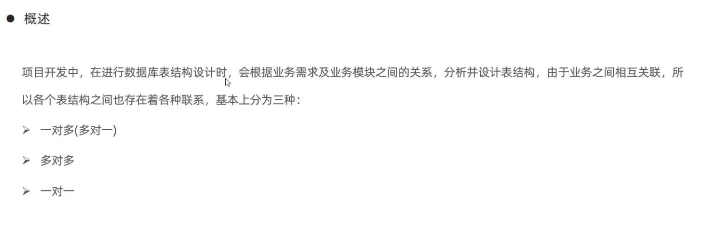

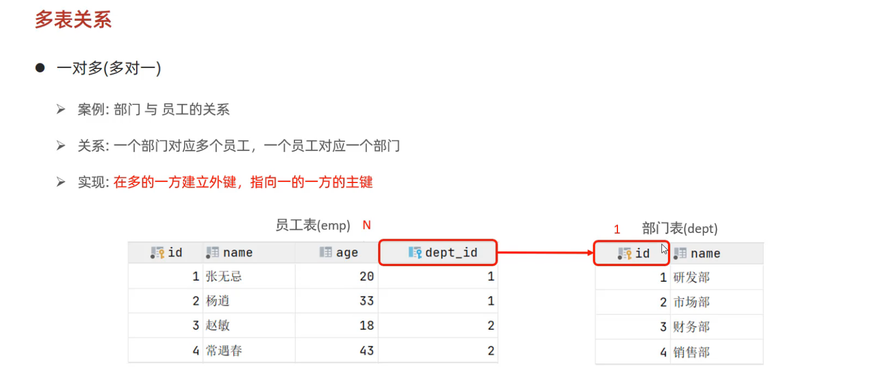

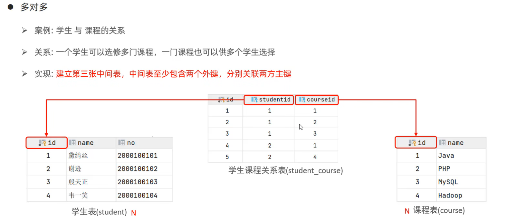

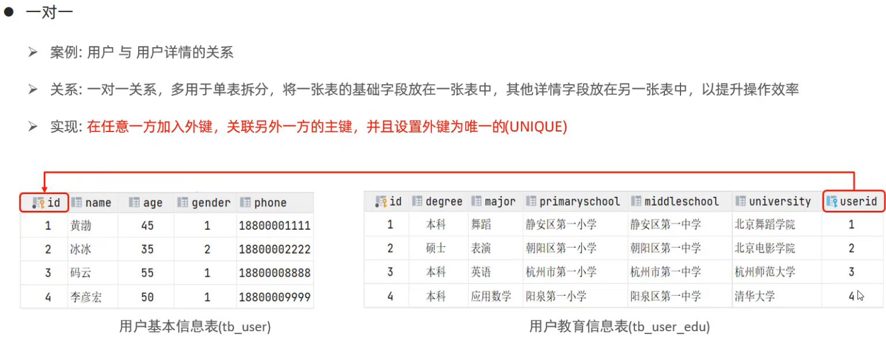

#### 1.5.1 多表查询

##### 1.5.1.1 概述

**概述:指从多张表中查询数据**

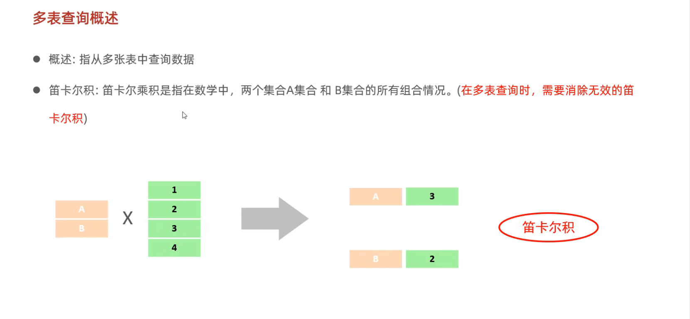

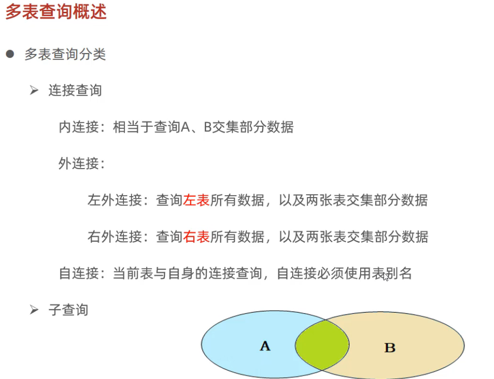

##### 1.5.1.2 内连接


**隐式例如:**

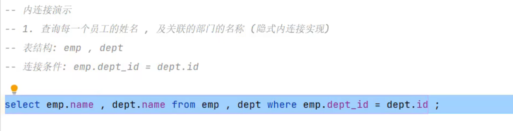

**显式例如:**


##### 1.5.1.3 外连接


例如

